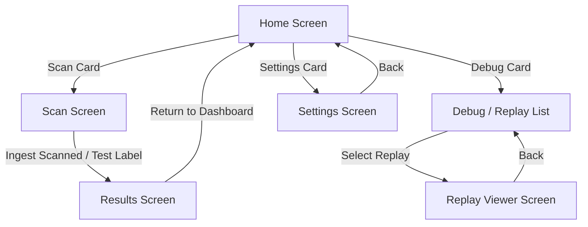

# NutriGuard - App Navigation Architecture

This document outlines the navigation patterns, backstack flows, and routing boundaries implemented in the NutriGuard Android application.

## Core Navigation Design

To maintain an offline-first, compile-safe, and deterministic routing behavior, NutriGuard avoids heavy external navigation libraries. Instead, it utilizes a custom, lightweight, state-based Compose navigation system.

### Navigation State Holder

Navigation is driven by the [NavController](file:///d:/projects/Ongoing/nutriguard/app/src/main/java/com/example/ui/navigation/NavController.kt) class:
- `currentScreen`: Represents the currently visible screen (backed by Compose `mutableStateOf`).
- `backStack`: A mutable list tracking the history of screens for hierarchical pop navigation.

```kotlin
class NavController(initialScreen: Screen = Screen.Home) {
    var currentScreen by mutableStateOf(initialScreen)
        private set

    private val backStack = mutableListOf<Screen>()

    fun navigateTo(screen: Screen) {
        backStack.add(currentScreen)
        currentScreen = screen
    }

    fun popBackStack(): Boolean {
        if (backStack.isNotEmpty()) {
            currentScreen = backStack.removeAt(backStack.size - 1)
            return true
        }
        return false
    }

    fun clearBackStackAndNavigate(screen: Screen) {
        backStack.clear()
        currentScreen = screen
    }
}
```

## Routes and Screen Boundaries

Screens are represented as subclass definitions of the sealed class [Screen](file:///d:/projects/Ongoing/nutriguard/app/src/main/java/com/example/ui/navigation/Screen.kt):

| Route / Screen | Arguments | Description |
|---|---|---|
| `Screen.Home` | None | Primary dashboard displaying status overview cards and navigation buttons. |
| `Screen.Scan` | None | Houses live CameraX preview (and test assets validation panel under debug mode). Runs ML Kit OCR. |
| `Screen.Results` | `rawOcrText`, `normalizedText`, `extractedTokens`, `canonicalJson`, `latencyJson` | Presents processed ingredients, confidence scores, and debugging latency tables. |
| `Screen.DebugReplay` | None | Exposes the in-app local benchmark utility and a log list of serialized failures. |
| `Screen.ReplayViewer` | `replayId` | Inspects details of a specific cache replay (metrics, failure categories, inputs/outputs). |
| `Screen.Settings` | None | Configure debugging switches, simulated benchmark mode, diagnostics overlay, and replay cache saving. |

## Navigation Workflow

The workflow below illustrates the screen routing flow:


