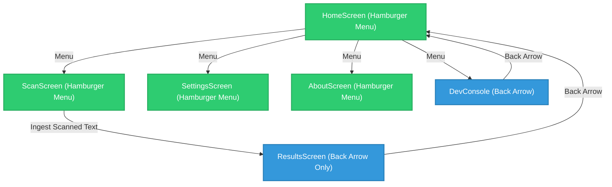

# Navigation Streamlining Audit — Stage 13.0E

This document records the audit of the screen navigation controls in the NutriGuard application and details the streamlining actions taken to eliminate duplicate backtrack and menu actions.

## 1. Screen Audit Registry

We audited all active screens to ensure navigation controls are unified under a single paradigm:
- **Top-Level Screens**: Main navigation via Side Hamburger Menu drawer only.
- **Child / Result Screens**: Backtrack navigation via Top App Bar Back Arrow only. No bottom back buttons or duplicate inline back actions.

| Screen | Screen Type | Controls Audited | Streamlining Decision | Actions Taken |
| :--- | :--- | :--- | :---: | :--- |
| **`HomeScreen`** | Top-Level | Top App Bar Hamburger Menu | **KEEP** | Standard navigation entry point. |
| **`ScanScreen`** | Top-Level | Top App Bar Hamburger Menu | **KEEP** | Retained Hamburger menu; camera analysis is decoupled. |
| **`SettingsScreen`** | Top-Level | Top App Bar Hamburger Menu | **KEEP** | Retained Hamburger menu for global settings access. |
| **`AboutScreen`** | Top-Level | Top App Bar Hamburger Menu | **KEEP** | Retained Hamburger menu. |
| **`ResultsScreen`** | Result / Child | 1. Top App Bar Back Arrow 2. `ResultsActionsRow` Back Button 3. Bottom Actions Row Back Button | **DELETE DUPLICATES** | - Removed bottom back and action button row entirely. - Removed `ResultsActionsRow` entirely. - Kept Top App Bar Back Arrow as the single backtrack navigation control. |
| **`DeveloperToolsScreen`**| Child | Top App Bar Back Arrow | **KEEP** | Simple backtrack control. |
| **`ReplayViewerScreen`** | Child | Top App Bar Back Arrow | **KEEP** | Simple backtrack control. |
| **`BenchmarkRunnerScreen`**| Child | Top App Bar Back Arrow | **KEEP** | Simple backtrack control. |

---

## 2. Navigation Flow Simplification Diagram

By removing duplicate "Back" actions in `ResultsScreen.kt`, we have unified navigation under a single backtrack path.
